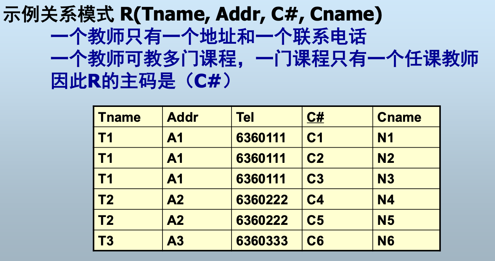

# 数据库系统及其应用

[toc]

<!-- markdownlint-disable MD051 -->
<!-- markdownlint-disable MD033 -->

## 过程化SQL

### 过程化SQL与SQL

SQL是描述性语言. 过程化SQL是对SQL的一个扩展，是一种过程化的程序设计语言。SQL本身并不能建立数据库应用程序。过程化SQL是包含SQL的一种过程性语言，它不仅支持SQL，还支持一些过程性语言特性。

- 过程化SQL与SQL二者均可以在DBMS中运行，可以相互调用

### 过程化SQL的程序结构

- 第1种结构
  - 在一次会话中使用过程化SQL语句编程
    - 赋值，输出，表达式计算，函数等等
    - 不能使用流程控制语句（分支、循环）
    - 不支持定义语句块Begin……End
    - 不允许定义局部变量
- 第2种结构
  - 在存储过程和触发器中编程
    - 支持全部的过程化程序设计要素
    - 支持事务编程

> 过程化SQL对SQL的主要扩展可以对比看C语言中实现的SQL不能做的事情，那就能看出来扩展在扩展什么了。

- *输入输出：
  - 输出：select，输入：NA
- 程序块定义：Begin……End
- 变量
- 流程控制
  - 顺序结构/分支结构/循环结构
- 出错处理
- 游标
  - 缓存一些动态数据
- 过程：存储过程/函数、触发器

#### 变量

- MySQL支持三种类型的变量
  - 局部变量
    - 必须使用DECLARE定义：<变量名> <类型>
    - 变量名使用常规定义，字母、数字、下划线
    - 作用域为Begin……End之间的程序块

            Begin
                Declare sno, snp INT DEFAULT 0;
                Declare name varchar(10);
                ……
            End

  - 用户变量
    - 不需要预先定义，变量名前须加一个“@”符号
    - 作用域为当前会话（连接），所有存储过程和函数可共享用户变量
  - 系统变量
    - MySQL内部定义的变量，变量名前有 “@@”符号
    - 作用域为所有客户端连接，只能读取
    - 一般用于在程序中判断系统当前的某个特定状态值
      - 例如：@@version
    - 查看所有的系统变量：show global variables

##### 变量的赋值

- Set赋值 （MySQL和MS SQL Server，Oracle用“:=”）
  - Declare status int;
  Set status=1; -- 局部变量须预先定义
  - Set @done=1；-- 用户变量不需要定义
- Select …… Into <变量> （都支持）
  - Select max(score) From SC into v1; -- 局部变量
  - Select sname from student where sno=‘s1’ Into @name; -- 用户变量
  - Select v1 into @name;
  - SELECT max(score) , min(score) into n2, n3 FROM SC;

> SELECT max(score) into n2 , min(score) into n3 FROM SC;是不可以的

    IF x＝5 THEN
        SET x=5;
    ELSEIF x=6 THEN
        SET x = 6;
    ELSE
        ...
    END IF;

注意分号（END IF）

    CASE case_value
        WHEN when_value THEN statement_list
        WHEN when_value THEN statement_list
        ...
        ELSE statement_list
    END CASE；
    //
    CASE
        WHEN search_condition THEN statement_list
        WHEN search_condition THEN statement_list
        ...
        ELSE statement_list
    END CASE；

#### 循环语句

##### while

    While <循环控制条件> Do
        <语句>
        ……
    End While;

##### REPEAT循环

    Repeat
        <语句>
        Until <循环控制条件>
    End Repeat;

##### LOOP循环

- 无内部控制结构的循环结构，循环执行其中的<语句>
- 必须在循环体中显式地结束循环
- 使用Leave语句退出循环

        Label : Loop
        <语句>
        IF <循环控制条件> THEN
            Leave Label;
        END IF;
        End Loop Label;

### 异常处理

- 存储过程内部执行时出错怎么办？
  - 需要使用错误陷阱，捕捉程序运行中出现的错误或意外情况，并加以处理
- 基本方法
  - Declare <处理方式> Handler For <异常类型> <sql>
    - <处理方式>
      - Continue：继续执行下一条语句
      - Exit：直接退出（很少用）
      - Undo：回退（目前不支持）
    - <异常类型>
      - SQLSTATE值
      - MySQL error code
      - SQLWARNING，NOT FOUND或SQLEXCEPTION，是SQLSTATE值简写
      - 与MySQL错误代码或SQLSTATE值相关联的命名条件。
    - \<sql\>
      - 当处理方式为Continue时执行的sql语句

#### 异常类型

SQLSTATE

- 5个字符，正常执行时返回00开头的State
- 01开头SQLSTATE——SQLWARNING
- 02开头SQLSTATE——NOT FOUND，表示游标或SELECT语句没有返回值
- 其它的SQLSTATE——SQLEXCEPTION

这是一个MySQL存储过程，用于处理数据库操作中的各种错误情况，通过状态码返回错误信息。

<!-- markdownlint-disable MD046 -->

```sql{.line-numbers}

DELIMITER //
CREATE PROCEDURE error_handler (IN sn VARCHAR(50), OUT state INT)
BEGIN
    DECLARE s INT DEFAULT 0;
    DECLARE CONTINUE HANDLER FOR 1146 SET s = 1; -- 表不存在的错误
    DECLARE CONTINUE HANDLER FOR SQLSTATE '42502' SET s = 2; -- 特定SQL状态错误
    DECLARE CONTINUE HANDLER FOR NOT FOUND SET s = 3; -- 查询结果为空
    DECLARE CONTINUE HANDLER FOR SQLEXEPTION SET s = 4; -- 其他SQL异常
    
    -- 开始事务
    START TRANSACTION;
    
    -- 执行DML语句(示例)
    SELECT age FROM student WHERE sno = sn INTO c;
    INSERT INTO ...;
    UPDATE student ...;
    
    -- 自定义异常检查
    IF <自定义异常> THEN -- 例如: 余额不足1000
        SET s = 5;
    END IF;
    
    -- 错误处理
    IF s = 0 THEN
        SET state = 0;
        COMMIT;
    ELSE
        CASE s -- 根据错误码设置返回状态
            WHEN 1 THEN 
                SET state = ...; -- 表不存在错误码
            WHEN 2 THEN
                SET state = ...; -- 权限错误码
            WHEN 3 THEN
                SET state = ...; -- 数据不存在错误码
            WHEN 4 THEN
                SET state = ...; -- 其他SQL错误码
            ELSE
                SET state = ...; -- 默认错误码
        END CASE;
        ROLLBACK; -- 回滚事务
    END IF;
END //
DELIMITER ;
```

### 事务编程

- 事务（transaction）
  - 不可分的DML操作序列
  - 例如，银行转账
  - Update A=A-100
  - Update B=B+100
- 事务的性质
  - ACID：Atomicity，Consistency，Isolation，Durability
- 需要对多个数据进行更新，并且具有事务特性时，需要将它们做成事务进行处理，从而保证更新时的数据一致性。
- 事务编程语句
  - Start transaction：开始事务。从此往后的所有DML操作都属于一个事务
  - Commit：提交事务。事务所做的修改全部生效，写入持久存储介质
  - Rollback：回滚事务。事务所做的修改全部取消，数据库回退到事务开始之前的状态

### 游标

游标只解决select问题

- 过程化SQL程序中的变量每次只能存储单个记录；而SQL是描述性语言，每次可能返回多行记录。问题：过程化SQL如何支持多行记录的操作？
  - **游标**是客户机或数据库服务器上开辟的一块内存，用于存放SQL返回的结果
  - 游标可以协调过程化SQL与SQL之间的数据处理矛盾
  - 过程化SQL程序（存储过程/函数）可以通过游标来存取SQL返回的结果

#### 声明

    Declare
        Cursor <名称> For <Select语句>

声明中的SQL语句在声明时并不执行，只是给出了游标对应的数据定义

    声明一个游标，用于存放所有学生记录
    DECLARE
        Cursor cs_stu For select * from student;

#### 打开游标

    Open <游标名> 
    打开游标时，SELECT语句被执行，其结果放入了游标中

#### 读取游标中的记录

    Fetch <游标名> Into <变量表>

- 打开游标后，游标指向了第一条记录
- Fetch后指向下一条记录
- 若要读取游标中的数据，一般需使用一个循环

#### 关闭游标

    Close <游标名>

### 存储过程和函数

- 存储过程
存储在数据库中的过程，可以随时运行，也可以被SQL或外部程序调用
- 函数
具有返回值的存储过程

#### 存储过程定义

Create Procedure <名称>(参数表)
BEGIN
    <变量定义>
    过程化SQL代码
    <异常处理>
END;

#### 参数定义

- [IN | OUT | INOUT] 参数名 数据类型
  - 例 IN name varchar(50), OUT result int
- IN参数
  - 输入参数，在程序中不能修改
  - 如果不指定参数类型，默认为IN
- OUT参数
  - 输出参数，在程序中只能对其赋值
- INOUT
  - 既可作为IN参数使用，也可作为OUT参数使用

所有数据都存在表里（只有表一种数据结构）

#### 查看存储过程

- Show Create Procedure <存储过程名>

#### 删除存储过程

- Drop Procedure <存储过程名>

#### 函数

- 具有返回值的存储过程

        Create Function <名称>(参数表)
        RETURNS <类型>
        [Deterministic | Reads SQL data | No SQL | MODIFIES SQL DATA]
        BEGIN
            <变量定义>
            过程化SQL代码
            RETURN <变量>；
            <异常处理>
        END;

函数类型：
Deterministic：同一参数值的输出结果确定
Reads SQL data：函数内部读数据库
No SQL：函数内部不读数据库
MODIFIES SQL DATA：表示函数会更新数据库

若设置了binlog信任函数创建者则无需指定类型
`SET GLOBAL log_bin_trust_function_creators = TRUE;`

### 触发器

#### 触发器的概念

- 与特定表关联的存储过程。当在该表上执行DML操作时，可以自动触发该存储过程执行相应的操作
  - **触发操作**：Update、Insert、Delete(只有这三种操作会修改数据库的内容，才有可能破坏数据库的完整性约束)
  - 通过触发器可以**定制数据库对应用程序的反应**
  - 一个触发器只能属于一个表，一个表可有多个触发器

#### 触发器的实例

Student（sno, sname, age, status）

- Sc( sno, cno, score)
- 规定当学生有3门课不及格时，将该学生的status标记为’不合格’
- 通过SC上的触发器实现：当在SC中插入或更新记录时，自动检查是否有学生满足不合格条件

#### 触发器的种类

- 按执行先后
  - 先触发器（Before Trigger）：在DML语句执行之前触发
  - 后触发器（After Trigger）：在DML语句执行之后触发
- 按执行方式
  - 替代触发器（Instead Trigger）：用触发器代码替代DML执行
  - 行级触发器：对由触发的DML语句所导致变更的每一行触发一次（一个DML语句可能触发多次）
  - 语句级触发器：一个DML语句只触发一次
- 特殊的触发器
  - DDL触发器：当执行DDL语句时触发
  - DB事件触发器：当系统STARTUP、SHUTDOWN、LOGON、LOGOFF等事件发生时触发

#### 触发器的创建

    Create Trigger <名称>
    [Before | After | Delete | Insert | Update]
    ON <表名>
    For Each Row
    BEGIN
        <过程化SQL程序>
    END;

注意：触发器没有参数，因为是自动执行的，不能向它传参数。一个触发器只能定义一个触发事件，如果要触发多个事件，则只能定义多个触发器（Oracle允许一个触发器触发多个事件）。

#### 系统变量old和new

- 对于行级触发器，系统变量old和new存储每一行的更新前值（old）和更新后值（new）
- 可以在触发器程序中需要时访问它们

||Insert|Update|Delete|
|--|--|--|--|
|old的值|空|原记录|删除的记录|
|new的值|新记录|新记录|空|

#### 查看触发器

- Show triggers: 显示当前数据库中的所有触发器
- Show create trigger <触发器名称>：显示特定的触发器

#### 触发器的主要作用

1. 强化约束：触发器能够实现复杂的约束。
2. 跟踪变化：触发器可以侦测数据库内的操作，可以用来实施审计，以及不允许数据库中未经许可的更新和变化。
3. 级联运行：触发器可以侦测数据库内操作，并自动地级联影响整个数据库的各项内容。

## 关系数据库模式设计

数据库模式是数据库中全体数据的逻辑结构和特征的描述。本章可回答哪个数据好，为什么好，如何优化等等问题。

### 关系模式的设计问题



- 关系模式设计不规范会带来一系列的问题
  - 数据冗余
    - T1教了三门课程，他的地址和电话被重复存储了2次
  - 更新异常
    - 如果T1的地址变了，则需要改变3个元组的地址；若有一个未更改，就会出现数据不一致。但DBMS无法获知这种不一致。
  - 插入异常
    - 如果要增加一名教师，但他还未带课，则C#和Cname为空，但由于C＃是主码，为空违反了实体完整性，所以这名教师将无法插入到数据库中。
  - 删除异常
    - 如果教师T3现在不带课了，则需将T3的元组删去，但同时也把他的姓名和地址电话信息删掉了。

||方法1|方法2|方法3|
|--|--|--|--|
|分解方式|R1(Tname, Addr, Tel)<br>R2(C#,Cname)|R1(Tname, Addr, Tel, C# )<br>R2( C#, Cname)|R1( Tname, Addr, Tel)<br>R2( Tname ,C#, Cname)|
|问题|授课信息丢失了|R1中问题依然存在|基本解决问题，但又带来联接查询代价|

### 函数依赖

关系模式的形式化定义：
**R（U，D，dom，F）**
R为关系模式名，U是一个属性集，D是U中属性的值所来自的域，Dom是属性向域的映射集合，F是属性间的依赖关系

#### 1、什么是函数依赖？

- 函数依赖是指一个关系模式中一个属性集和另一个属性集间的多对一关系
- 例如**选课关系SC(S#, C#, Score)**
  - 存在由属性集{S#, C#}到属性集{Score}的函数依赖
    - 对于任意给定的S#值和C#值，只有一个Score值与其对应
    - 反过来，可以存在多个S#值和C#值，它们对应的Score值相等

#### 2、基本概念

函数依赖（FD，Functional Dependency）的形式化定义

- 设关系模式R(A1,A2,…,An)或简记为R(U)，X和Y是U的子集。r是R的任意一个实例（关系），若r的任意两个元组t1、t2，由t1[X]=t2[X]可导致t1[Y]=t2[Y]，即如果X相等则Y也相等，则称Y函数依赖于X或称为X函数决定Y，记作 X→Y
  - 即R的X属性集上的值可唯一决定R的Y属性集上的值
  - 也即对于R的任意两个元组，X上的值相等，则Y上的值也必相等
- FD是相对于关系模式而言的，因此关系模式R的所有实例都要满足FD
- FD是关系模式的一部分

#### 3、平凡FD和不平凡FD

 模式设计的首要问题是确定关系模式的最小函数依赖集
给定一个函数依赖集S，若能找到一个远小于S的函数依赖集T，则
DBMS只要实现T就可实现S中的所有函数依赖
 平凡FD和不平凡FD
X→Y，且Y ⊆ X，则X→Y是平凡FD，否则是不平凡FD
 平凡FD没有什么实际意义，消除平凡FD是缩小函数依赖集大
小的一个简单方法

#### 4、函数依赖集的闭包

 函数依赖的逻辑蕴含
设F是关系模式R的一个函数依赖集，X和Y是R的属性子集，若从F的
函数依赖中能推出X→Y，则称F逻辑蕴含X→Y，记作F X→Y
 函数依赖集的闭包
被函数依赖集F逻辑蕴含的函数依赖的全体构成的集合称为F的闭包
，记做F+

（1）函数依赖的推理规则
 Armstrong公理，可以从给定的函数依赖中推出新的函数依赖
自反律（Reflexity）：若B ⊆ A，则A→B成立
增广律（Augmentation）：若A→B，则AC→BC（AC表示A∪C）
传递律（Transitivity）：若A→B， B→C，则A→C
自含律（Self_Determination）： A→A
分解律（Decomposition）：若A→BC，则A→B，且A→C
合并律（Union）：若A→B， A→C，则A→BC
复合律（Composition）：若A→B， C→D，则AC→BD

##### （1）函数依赖的推理规则

 R( A, B, C, D, E, F)
 F={A→BC, B→E, CD→EF}
 AD→F对于函数依赖集F是否成立？
A→BC（已知）
A→C （分解律）
AD→CD（增广律）
CD→EF（已知）
AD→EF（传递律）
AD→F（分解律）

##### （2）码的形式化定义

- 设关系模式R(U)，F是R的一个FD集，X是U的一个子集，若X→U ∈ F+，则X是R的一个超码，如果同时
不存在X的真子集Y，使得Y→U成立，则X是R的一个候选码

> X可以唯一决定一个元组，第二条意味着没有比X更小的超码，因此是候选码的定义。

- R(Tname, Addr, C#, Cname)
F={Tname→Addr, C#→Cname, C#→Tname}
C#→{Tname,Addr,C#,Cname}（利用了传递律，最后得到C#可以唯一决定一个元组）
所以C#是候选码，若C#→Tname不成立，则候选码为{Tname, C#}

5、属性集的闭包
 函数依赖集的闭包计算很麻烦
 给定一个函数依赖集F，如何判断函数依赖X→Y是否可以从F
中推出？
 属性集的闭包
设F是属性集U上的一个FD集，X是U的子集，则称所有用
Armstrong推理规则推出的函数依赖X→A中所有A的集合，称为属
性集X关于F的闭包，记做X+
 X→Y能由Armstrong推理规则推出的充要条件是Y⊆ X+

关系模式R(A,B,C, D)
 F＝{A→B, B→C, B→D, A→D }
A+=ABCD
B+=BCD
C+=C
D +=D
 不用计算F+，就可知A→CD ∈ F+

> 利用A+ = ABCD 推出A→B，A→C所以有合并律即可。

#### 6、最小函数依赖集

 函数依赖集的等价和覆盖
设S1和S2是两个函数依赖集，若S1+⊆ S2+
,则称S2是S1的覆盖（或
S2覆盖S1）
DBMS只要实现S2中的函数依赖，就自动实现了S1中的函数依赖
若S2是S1的覆盖，且S1是S2的覆盖，则称S1与S2等价
DBMS只要实现任意一个FD集，就可自动实现另一个FD集

##### （1）定义

 当且仅当函数依赖集F满足下面条件，F是最小函数依赖集：
F的每个FD的右边只有一个属性
> 如果右边有多个属性，可通过分解律进行简化
F不可约：F中的每个X→Y，F－{X→Y}与F不等价
F的每个FD的左部不可约：删除左边的任何一个属性都会使F转变为一个不等价于原来的F的集合

（2）举例
 Student(S#,Sname,Age, Sex)
F1={S#→Sname, S#→age, S#→sex}是最小函数依赖集
F2={S#→{S#,Sname}, S#→age, S#→sex}不是最小函数依赖
集【右边不是单属性】
F3={S#→Sname, {S#,Sname}→age, S#→sex}不是最小函数
依赖集【左部可约】
F4={S#→S#, S#→Sname, S#→age, S#→sex}不是最小函数
依赖集【FD可约】

##### （3）求最小函数依赖集

- R(A,B,C,D)，F={A→BC, B→C, A→B, AB→C, AC→D}
  - 将右边写出单属性并去除重复FD（分解律）
    - F={A→B, A→C, B→C, A→B, AB→C, AC→D}
    - F={A→B, A→C, B→C, AB→C, AC→D}
  - 消去左部冗余属性
    - A→C， AC→D可推出A→AC， A→D，因此可去除AC→D中的C
    - A→C，可推出AB→BC可得AB→C ，所以AB →C中的B是冗余属性
    - F={A→B, A→C, B→C, A→C, A→D}
    - ={A→B, A→C, B→C, A→D}
  - 消去冗余函数依赖
    - A→C冗余，因为可由A→B， B→C推出
    - F={A→B, B→C, A→D}

### 三、模式分解

 概念
 无损连接(Lossless Join)
 保持函数依赖(Preserve Dependency)

#### 定义

- 设有关系模式 $R(U)$ 和 $R_1(U_1)$, $R_2(U_2)$, ..., $R_k(U_k)$
- 其中 $U = U_1 \cup U_2 \cup \dots \cup U_k$
- 设 $\rho = \{R_1, R_2, \dots, R_k\}$，则称 $\rho$ 为 $R$ 的一个分解

模式分解的含义

1. **属性集的分解**
2. **函数依赖集的分解**

##### 示例

关系模式 $R(A,B,C)$，函数依赖集 $F = \{A \to B, C \to B\}$  
分解为 $R_1(A,B)$ 和 $R_2(A,C)$ 时，**丢失了 $C \to B$**

2、模式分解的标准
 具有无损连接
 要保持函数依赖
 既具有无损连接，又要保持函数依赖

3、无损连接
 动机
 概念
 无损连接的测试

模式分解的过程应是可逆的，R的所有数据在分解后应没有丢失（两个方面，可以是不能少，也可以是不能增加原来没有）

##### （3）无损连接的测试

 方法1：Chase
输入：关系模式R(A1,A2,…,An)，R上的函数依赖集F，R的一个分
解p={R1,…,Rk}
输出：判断p相对于F是否具有无损连接性
算法：Chase

**Chase过程**：

1. **初始化表格**  
   - 构造一个k行n列的表格  
   - 每行对应一个模式Ri (1≤i≤k)，每列对应一个属性Aj (1≤j≤n)  
   - 若Aj在Ri中，则在第i行第j列填aj，否则填符号bij  

2. **检查并修改表格**  
   - 对于F中的每个函数依赖X→Y：  
     - 若表格中有两行在X分量上相等，在Y分量上不相等：  
       - 若Y的分量中有一个aj，则将另一个也改为aj  
       - 若没有aj，则将其中一个bij替换为另一个（选择行号较小的b）  
   - 重复上述过程，直到表格无法继续修改  

3. **判断无损连接**  
   - 若修改后的表格中存在一行全为a（即a1a2…an），则分解ρ相对于F是无损连接的  
   - 否则，分解ρ不是无损连接的  

扫描一次F后，若表格中未出现全a的行，则进行下一次扫描。由于每次扫描F至少能减少一个符号，而符号有限，因此算法最后必然终止。
终止条件：全a行，表格扫描后不再发生任何修改。

**4. 保持函数依赖**
**定义**  
设关系模式 \( R(U) \) 的FD集为 \( F \)，分解 \( \rho = \{R_1, R_2, \dots, R_k\} \) 若满足以下条件，则称 \( \rho \) 保持函数依赖：  
\[
\bigcup_{i=1}^k \pi_{R_i}(F) \equiv F
\]  
其中：

- \( \pi_{Z}(F) \) 是 \( F \) 在属性集 \( Z \) 上的投影，定义为：  
  \[
  \pi_{Z}(F) = \{ X \to Y \mid X \to Y \in F^+ \land XY \subseteq Z \}
  \]
- \( F^+ \) 表示 \( F \) 的闭包（即 \( F \) 逻辑蕴含的所有FD）。

**关键点**  

1. **保持依赖的直观含义**：  
   分解后的局部FD（\( \pi_{R_i}(F) \)）能完全推导出原FD集 \( F \)。  
2. **判定方法**：  
   - 计算所有 \( \pi_{R_i}(F) \) 的并集。  
   - 验证该并集是否与 \( F \) 逻辑等价（即互相推导）。

**示例**  
设 \( R(A,B,C) \)，\( F = \{A \to B, B \to C\} \)，分解 \( \rho = \{R_1(A,B), R_2(B,C)\} \)：

- \( \pi_{R_1}(F) = \{A \to B\} \)  
- \( \pi_{R_2}(F) = \{B \to C\} \)  
- \( \pi_{R_1}(F) \cup \pi_{R_2}(F) = F \) ⇒ **保持依赖**。  

若分解为 \( \rho' = \{R_1(A,B), R_2(A,C)\} \)：

- \( \pi_{R_1}(F) = \{A \to B\} \)  
- \( \pi_{R_2}(F) = \emptyset \)（因 \( B \to C \) 无法投影到 \( R_2 \)）  
- 丢失 \( B \to C \) ⇒ **不保持依赖**。

**无损连接与保持依赖的示例分析**：

#### 关系模式与函数依赖

- **模式**：`R(city, street, zip)`
- **FD集**：`F = { (city,street)→zip, zip→city }`
- **分解**：`ρ = { R1(street,zip), R2(city,zip) }`

---

### 1. 无损连接性测试

- **交集**：`R1 ∩ R2 = {zip}`
- **差集**：`R2 − R1 = {city}`
- **检查FD**：`zip → city` ∈ F  
  **结论**：满足 `(R1 ∩ R2) → (R2 − R1)` ⇒ **分解是无损连接的**

---

### 2. 保持函数依赖性测试

- **投影计算**：
  - `π_R1(F)`：仅含平凡FD（因 `(city,street)→zip` 无法投影到 `R1(street,zip)`）
  - `π_R2(F)`：包含 `zip→city` 及平凡FD
- **并集结果**：`π_R1(F) ∪ π_R2(F) = { zip→city }⁺`
  - 丢失原FD `(city,street)→zip`
- **结论**：`{ zip→city }⁺ ≠ F⁺` ⇒ **不保持函数依赖**

---

### 关键总结

- **无损连接**：依赖公共属性 `zip` 能决定差集属性 `city`。
- **依赖丢失**：原FD `(city,street)→zip` 因属性分散到不同子模式而无法保留。

**不保持函数依赖带来的问题分析**
**原始关系与分解**：

- 关系模式：R(city, street, zip)
- 函数依赖：F = {(city,street)→zip, zip→city}
- 分解方案：ρ = {R1(street,zip), R2(city,zip)}

**数据操作示例**：

1. 向R1插入：('a','100081'), ('a','100082')
2. 向R2插入：('Beijing','100081'), ('Beijing','100082')

**连接结果**：

| City    | Street | Zip    |
|---------|--------|--------|
| Beijing | a      | 100081 |
| Beijing | a      | 100082 |

**问题说明**：

1. 函数依赖丢失：分解后丢失了(city,street)→zip
2. 语义违反：相同(city,street)组合对应多个zip值
3. 完整性破坏：原始业务规则(city,street必须唯一确定zip)被破坏

**关键影响**：

- 数据冗余：相同城市街道组合出现多次
- 数据不一致：同一地址对应多个邮编
- 约束失效：无法保证地址到邮编的一对一映射关系
- 查询异常：基于地址查询邮编可能得到多个结果

**结论**
不保持函数依赖的分解虽然可能满足无损连接，但会导致数据语义完整性的破坏，在实际应用中会产生严重的数据一致性问题。
