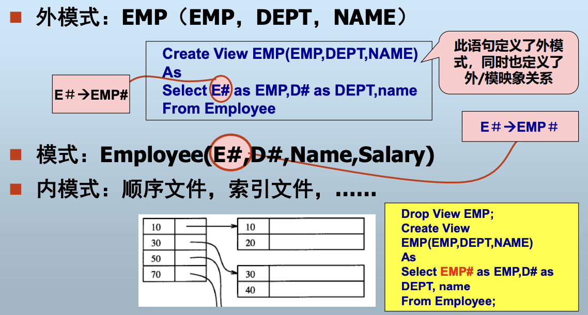
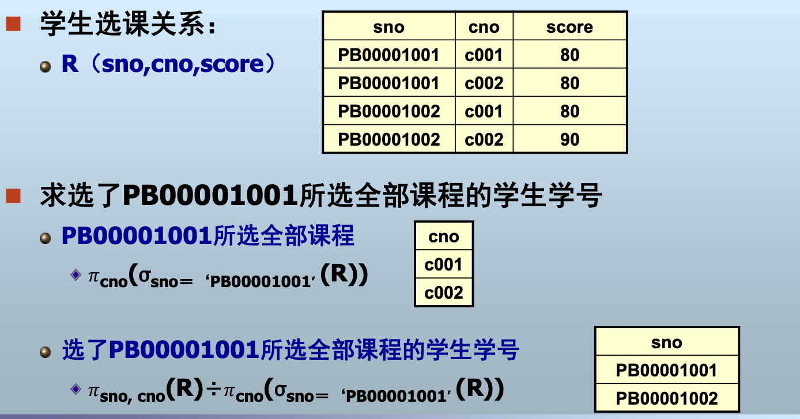
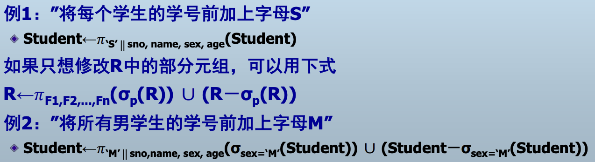
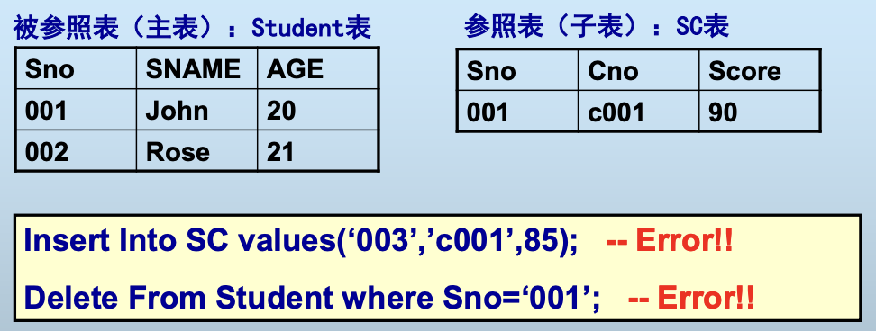

# 数据库系统及其应用

[toc]

<!-- markdownlint-disable MD051 -->

## 课程内容

**数据组织**:数据如何组织并存储到数据库中？
    > 数据库系统体系结构，数据模型，**数据库设计**
**数据存取**:应用如何访问数据库中的数据？
    > SQL和PL/SQL,数据库应用编程
**数据管理**:如何保证数据的一致性、安全性和存取效率？
    > 事务管理，恢复、并发控制、完整性、安全性、索引、查询优化等

理解关系数据模型的设计原理,如何用关系代数和SQL正确表达用户查询,如何评价数据库设计的好坏,如何给出一个好的数据库设计,理解DBMS的事务处理机制。

## 概述

### 基本内容

数据(Data)是数据库中存储的基本对象。

数据的定义：人们用来反映客观世界而记录下来的可以鉴别的符号。

数据的种类

> 数值数据、非数值数据

数据的特点：数据与其语义是不可分的

数据库的定义：

> 数据库(Database,简称DB)是**长期**储存在计算机内、**有组织**的、**可共享**的大量数据的集合

数据库的基本特征
**长期储存**：持久存储，一般数据量比较大
**有组织的**：数据按一定的数据模型组织、描述和储存
**可共享的**：可为各种用户共享
数据间联系密切，具有最小的冗余度和较高的独立性
一个数据库一般服务于某个特定的应用

**数据库模式**是数据库中全体数据的逻辑结构和特征的描述。

DBMS（Database Management System），是计算机程序的集合,用于创建和维护数据库。

1. 于操作系统和用户应用之间
2. 总是基于某种数据模型

DBS(DataBase System),指在计算机系统中引入了数据库后的系统，即采用了数据库技术的计算机系统.

1. 数据: 数据库中的数据
2. 硬件: 二级存储器、处理器、主存等计算机硬件
3. 软件: DBMS、应用系统
4. 用户

#### 为什么使用数据库？

> “集中存储，统一管理”

1. 数据库定义
   数据库对象定义：表、索引、约束、用户等
2. 数据库操纵
   实现对数据库的基本操作：增、删、改、查
3. 数据库保护
   恢复、并发控制、完整性控制、安全性控制
4. 数据库的建立和维护
   初始数据的转换和装入、数据备份、数据库的重组织、性能监控和分析等
   通常由一些实用程序完成

数据库系统的分类

- 按所支持的用户数
  - 单用户DBMS(目前已经很少见)
  - 多用户DBMS
- 按允许数据库可以分布的站点数
  - 集中式DBMS
  - 分布式DBMS
- 按用途
  - 通用DBMS,如Oracle、Informix等
  - 专用DBMS,如时态数据库、空间数据库等
- 按数据模型
  - 网状型DBMS
  - 层次型DBMS
  - 关系型DBMS
  - 对象DBMS
  - NoSQL

| **特性**     | **关系数据库**               | **NoSQL数据库**                             |
| ------------------ | ---------------------------------- | ------------------------------------------------- |
| **数据模型** | 基于表结构，严格遵循Schema（模式） | 灵活的非结构化/半结构化（键值、文档、列族、图等） |
| **扩展性**   | 垂直扩展（升级单机性能）           | 水平扩展（分布式集群）                            |
| **事务支持** | 强ACID（原子性、一致性等）         | 通常弱化（部分支持BASE理论）                      |
| **查询语言** | SQL（标准化）                      | 无统一语言，依赖API或特定语法                     |
| **适用场景** | 复杂查询、强一致性、事务性操作     | 高并发、大数据量、灵活数据模型                    |

现在主流仍然是关系数据库。

## 数据库系统体系结构

### 数据库模式的概念

模式（Schema）和实例（Instance）
**模式**是数据库中全体数据的逻辑结构和特征的描述，它仅仅涉及类型的描述，不涉及具体的值。
模式的一个具体值称为模式的一个**实例**。

一个模式可有很多实例
模式——反映数据的结构及联系
实例——反映的是某一时刻数据库的状态

模式相对稳定，而实例相对变动。

ANSI/SPARC体系结构——**三级模式结构＋两级映象**
Oracle、MySQL等SQL数据库系统的模式结构可通过ANSI/SPARC体系结构进行解释

### 数据库的三级模式结构

外模式、概念模式、内模式

#### 概念模式

数据库中全体数据的逻辑结构和特征的描述
数据记录由哪些数据项构成？

- 数据项的名字、类型、取值范围
- 数据之间的联系、数据的完整性等

不涉及数据物理存储的细节和硬件环境
一个数据库只有一个概念模式
概念视图：概念模式的实例（比如一个科大数据库就是一个概念模式的实例）
通过模式DDL进行定义

> DDL：Data Definition Language，负责操作模式的数据库语言

#### 外模式（子模式、用户模式）

单个用户所看到的局部数据的逻辑结构和特征的描述
用户与数据库系统的数据接口，对于用户而言，外模式就是数据库
建立在概念模式之上，同一模式上可有多个不同的外模式
外部视图：外模式的实例
通过外模式DDL进行定义

#### 内模式（存储模式）

存储结构就是文件结构。
数据物理结构和存储方式的描述。

记录的存储方式：顺序存储、按B树组织还是散列存储？
索引按什么方式组织：排序、散列？
数据是否加密？是否压缩存储？

不涉及物理块（或页）的大小，也不考虑具体设备的柱面或磁道大小
一个数据库只有一个内模式
内部视图：内模式的实例
通过内模式DDL定义

### 二级映象和数据独立性

    为什么需要三层？
    已经具有一定的独立性了。

二级映象实现三级模式结构间的联系和转换，使用户可以逻辑地处理数据，不必关系数据的底层表示方式和存储方式——提高数据库应用程序的可维护性。

外模式/模式映象——数据的逻辑独立性
模式/内模式映象——数据的物理独立性

### 数据库系统外部体系结构

#### 1、客户机／服务器结构的数据库系统

把DBMS功能和应用分开
网络中某个（些）结点上的计算机专门用于执行DBMS功能，称为数据库服务器（Server）
其他结点上的计算机安装DBMS的外围应用开发工具、用户的应用系统，称为客户机（Client）

> Client/Server架构，简称C/S架构

##### 优点（Client/Server架构）

客户端的用户请求被传送到数据库服务器，数据库服务器进行处理后，只将结果返回给用户，从而显著减少了数据传输量。
客户机与服务器一般都能在多种不同的硬件和软件平台上运行。
可以使用不同厂商的数据库应用开发工具。

##### 缺点（Client/Server架构）

系统安装复杂，工作量大。
相同的应用程序要重复安装在每一台客户机上，从系统总体来看，大大浪费了系统资源。

#### 2、浏览器／服务器结构的数据库系统

与客户机/服务器结构类似，不同之处在于客户机统一使用浏览器软件，统一的用户界面服务器：包括Web服务器和数据库服务器。

##### 优点

- 统一的客户机界面，减少了应用安装和维护的工作量
- 基于Web技术，支持互联网应用

##### 缺点：安全性问题

- 用户访问无地域限制，难以控制网络恶意攻击
- 开发工具的能力相对较弱

#### 3、分布式结构的数据库系统

数据库中的数据在逻辑上是一个整体，但物理地分布在计算机网络的不同结点上。
网络中的每个结点都可以独立处理本地数据库中的数据，执行局部应用
同时也可以同时存取和处理多个异地数据库中的数据，执行全局应用

##### 特点

物理分布、逻辑统一
不同概念模式组合起来形成的一个整体的概念模式，最主要的开销是网络传输

##### 优点(D)

适应了地理上分散的公司、团体和组织对于数据库应用的需求。

##### 缺点(D)

数据的分布存放给数据的处理、管理与维护带来困难。
当用户需要经常访问远程数据时，系统效率会明显地受到网络传输的制约。

## 关系数据库

### 数据模型

> 使用数据库，首先必须把现实中的事物表示为计算机能够处理的数据

模型是对现实世界特征的抽象，数据模型是对现实世界数据特征的抽象。

数据模型的**定义**:
描述现实世界**实体**、**实体间联系**以及**数据语义**和**一致性约束**的模型。

#### 数据模型的分类

根据模型应用的不同目的

1. 概念数据模型（概念模型）
   - 按用户的观点对数据进行建模，强调语义表达功能（不在乎实现），基本是图形设计。
   - 独立于计算机系统和DBMS
   - 主要用于数据库的概念设计
2. 结构数据模型（数据模型）
   - 按计算机系统的观点对数据进行建模，直接面向数据库的逻辑结构
   - 与计算机系统和DBMS相关
     - 回顾：DBMS支持某种数据模型
   - 有严格的形式化定义，以便于在计算机系统中实现

现实世界--概念模型--数据模型

#### 数据模型的三要素

数据结构

- 现实世界实体及实体间联系的表示和实现

数据操作

- 数据检索和更新的实现

数据的完整性约束

- 数据及数据间联系应具有的制约和依赖规则

### 关系模型概论

关系模型
用二维表格结构表示实体集，**外码**表示实体间联系，三类完整性规则表示数据约束的数据模型

#### 1. 一些概念术语

[戳这回到代数运算部分](#关系代数)

- 属性(Attribute)
  - 二维表格的每一列称为关系的一个属性，列的数目称为度（degree）
- 元组(Tuple)
  - 每一行称为关系的一个元组，元组的数目称为势或者基数（cardinality）
- 域(Domain)
  - 一组具有相同数据类型的值的集合。每个属性有一个域
- 关系(Relation)
  - 元组的集合

#### 2. 关系、关系模式与关系数据库

- 关系模式(Relation Schema)
  - 关系的逻辑结构和特征的描述
  - 对应于二维表格的表头
  - 通常由属性集和各属性域表示，不关心域时可省略域
    Student(Name, Age, Class)
- 关系
  关系模式的实例，即二维表（元组的集合）
- 关系数据库模式(Relational Database Schema)
- 关系模式的集合
  - 关系数据库：关系数据库模式的实例

#### 3. 关系模式的形式化定义

- 关系模式可以形式化定义为：R(U, D, dom, F)

  > R为关系模式名，U是一个属性集，D是U中属性的值所来自的域，Dom是属性向域的映射集合，F是属性间的依赖关系
  >
- 例：Student关系模式的定义
  Student(U, D, dom, F)
  U={sno, name, age}
  D={CHAR, INT}
  Dom={dom(sno)=dom(name)=CHAR, dom(age)=INT}
  F={sno→name, sno→age}
- 关系模式通常简写为R(U)，R(A1,A2,…)或R

#### 4. 超码、候选码和主码{#超码候选码和主码}

[点此查看关系模型的三类完整性规则](#7-关系模型的三类完整性规则)

为了区分实体。有时候很难通过唯一的属性来区分实体。

- 超码（Super Key）
  在关系模式中能**唯一标识一个元组的属性集**称为关系模式的超码
- 候选码（Candidate Key）
  - 不含多余属性的超码
  - 包含在某个候选码中的属性称为主属性（Primary Attribute）
  - 不包含在任何一个候选码中的属性称为非主属性（Non-prime Attribute）
- 主码（Primary Key）
  用户选作元组标识的一个候选码称为主码，其余的候选码称为替换码（Alternate Key）。

> 比如说： 学生的学号和一卡通id这两个属性组成一个集合称为超码，学号或一卡通id都为候选码，若在教务系统里，大概率以学号区分学生，则此时学号为主码，一卡通id为替换码。

#### 5. 关系的性质

- 一个关系是一个规范化的二维表格
  - 属性值不可分解
    - 不允许表中有表
  - 元组不可重复
    - 因此一个关系模式至少存在一个候选码
  - 没有行序，即元组之间无序
    - 关系是元组的集合
  - 没有列序，即属性之间无序
    - 关系模式是属性的集合

#### 6. 关系模型的形式化定义

- 数据结构
  关系：数据库中全部数据及数据间联系都以关系来表示
- 数据操作
  - 关系运算
    - **关系代数**
    - *关系演算（元组关系演算、域关系演算）
- 数据的完整性约束
  - 关系模型的三类完整性规则

#### 7. 关系模型的三类完整性规则

关系数据库的数据和操作必须遵循的规则

- 实体完整性(Entity Integrity)
- 参照完整性(Referential Integrity)
- 用户自定义完整性(User-Defined Integrity)

> 实体满足什么约束，实体之间的关系满足什么约束

##### （1）实体完整性

[点此查看主码定义](#超码候选码和主码)

关系模式R的主码不可为空

> 指组成主码的所有属性均不可取空值

##### （2）参照完整性

- 外码（Foreign Key）
  - 关系模式R的外码是它的一个属性集FK，满足：
    - 存在带有候选码CK的关系模式S，且
    - R的任一非空FK值都在S的CK中有一个相同的值
  - S称为被参照关系（Referenced Relation），R称为参照关系（Referential Relation）。
    
- 参照关系R的任一个外码值必须
  - 等于被参照关系S中所参照的候选码的某个值
  - 或者为空
    

##### （3）用户自定义完整性

- 针对某一具体数据的约束条件，反映某一具体应用所涉及的数据必须满足的特殊语义
- 由应用环境决定（比如学生成绩，在某些表格里要求大于0小于100等等）

`<a href="#xxx">` 回顾：关系模型的形式化定义 `</a>` `<!--注意在引用时前面要加"#"-->`

### 三、关系代数(Relational Algebra)

- Algebra=<A, O>
  A：一个类型的集合
  O：A上的代数运算集合，须满足在A上的封闭性
- 关系代数：Relational Algebra=<A, O>
  - A：关系，关系代数中只存在一种类型，即关系
  - O：关系代数运算，也称关系代数操作，以关系为运算对象的一组运算集合
  - 满足封闭性：任何关系代数运算的结果仍是关系

[戳这看元组定义](#一些概念术语)

- 传统的集合操作
  **并**（Union）：返回两个关系中所有元组。
  **交**（Intersection）：返回两个关系共同的元组。
  **差**（Difference）：返回属于第一个关系但不属于第二个关系的元组。
  笛卡儿积（Cartesian Product）：返回两个关系的元组的任意组合所得到的元组集合。
- 专门的关系操作
  **选择**（Select）：返回指定关系中**满足给定条件**的元组
  **投影**（Project）：返回指定关系中**去掉若干属性**后所得的元组
  **连接**（Join）：从两个关系的笛卡儿积中**选取属性间满足给定条件**的元组
  **除**（Divide）：除的结果与第二个关系的笛卡儿积包含在第一个关系中

关系代数的封闭性：任意关系代数操作的结果仍是一个关系，保证了关系代数操作的可嵌套性。

（1）并

- $R \cup S = \{t | t\in R \vee t \in S\}$
  - t是元组变量
  - R和S是关系代数表达式
  - R与S的degree必须相同_?
  - R与S的类型必须相同

（2）交

- $R \cap S = \{t | t\in R \wedge t \in S\}$
  - t是元组变量
  - R和S是关系代数表达式
  - R与S的degree必须相同
  - R与S的类型必须相同

（3）差

- $R - S = \{t | t\in R \wedge t \notin S\}$
  - t是元组变量
  - R和S是关系代数表达式
  - R与S的degree必须相同
  - R与S的类型必须相同

（4）积

- $R \times S = \{t | t = \left \langle t^r,t^s \right \rangle  \wedge t^r \in R \wedge t^s \in S\}$

  - 

(5) 选择

- $\sigma_F(R)＝\{ t|t\in R∧F(t)=TRUE \}$

  - 水平划分关系
  - F是一个逻辑表达式，表示所选的元组应满足的条件
  - F由逻辑运算符$\neg$(NOT)、$\wedge$(AND)、$\vee$(OR)连接算术表达式构成
  - 算术表达式形为$X\theta Y$，$\theta$可以是>,<,=, ≤,≥或≠，X和Y可以是属性名、常量或简单函数

（6）投影

- $\pi_A (R) = \{t[A] | t\in R \}$,其中A是R的属性子集
  - 垂直划分关系，选取若干列所构成的关系
  - A中的属性不可重复
    

（7）连接:自然连接

[返回复杂操作](#关系代数表达式示例)

> 如果研究实体之间的联系，一般就是用连接操作。

- 设R的属性集为{X,Y}，S的属性集为{Y,Z}
- $R\Join S=\{t|t =\left \langle X,Y,Z \right \rangle\wedge t[X,Y]\in R \wedge t[Y,Z]\in S\}$
  - 相当于在R×S中选取R和S的所有公共属性值都相等的元组，并在结果中去掉重复属性

(8) $\theta$ 连接

- 设R的属性集为{X,Y}，S的属性集为{Y,Z}
- $R \underset{\theta}{\Join} S = \{t | t = \left \langle t^r,t^s \right \rangle  \wedge t^r \in R \wedge t^s \in S\}$
  - 相当于在R×S中选取R的属性A值与S的属性B值满足比较关系$\theta$的元组。

(9) 等值连接

- 在θ连接中，**当θ为等号时**，称“等值连接”。
  - 等值连接是θ连接中比较常见的形式。

（10）除

- 设关系R的属性集为{X,Y}，S的属性集为{Y}，则$R\div S$的结果是一个关系P，P的属性集为{X}，并且$P\times S$包含在R中。
  - P的degree＝R的degree－S的degree

$R\div S$的计算方法:
\[
\begin{align*}
T &= \pi_X(R) \\
W &= (T \times S) - R \\
V &= \pi_X(W) \\
R \div S &= T - V
\end{align*}
\]

> 计算{X}和{Y}的积中不包含在R中的{X},T减去这部分{X}，剩下的就是
> {X}×{Y}包含在R中的{X}，就是最终的结果。

#### 关系代数中的除法运算示例

##### 问题描述

给定学生选课关系 \( R(sno, cno, score) \)，其中：

- \( sno \) 是学生学号。
- \( cno \) 是课程编号。
- \( score \) 是成绩。

目标是找到选了 **PB00001001** 所选全部课程的学生学号。

---

##### 数据

###### 关系 \( R \)

| sno        | cno  | score |
| ---------- | ---- | ----- |
| PB00001001 | c001 | 80    |
| PB00001001 | c002 | 80    |
| PB00001002 | c001 | 80    |
| PB00001002 | c002 | 90    |

---

##### 步骤分析

###### 1. 定义关系 \( S \)

\( S \) 是 **PB00001001** 所选的全部课程，通过选择操作和投影操作得到：
\[
S = \pi_{cno}(\sigma_{sno='PB00001001'}(R))
\]
根据数据：
\[
S = \begin{bmatrix}
cno \\
c001 \\
c002
\end{bmatrix}
\]

---

###### 2. 对 \( R \) 进行投影

在计算差运算之前，我们需要对 \( R \) 进行投影，只保留学号（`sno`）和课程编号（`cno`）：
\[
R_{\text{projected}} = \pi_{sno, cno}(R)
\]
根据数据：
\[
R_{\text{projected}} = \begin{bmatrix}
sno & cno \\
PB00001001 & c001 \\
PB00001001 & c002 \\
PB00001002 & c001 \\
PB00001002 & c002
\end{bmatrix}
\]

---

###### 3. 计算 \( T \)

\( T \) 是所有学生的学号，通过投影操作得到：
\[
T = \pi_{sno}(R_{\text{projected}})
\]
根据数据：
\[
T = \begin{bmatrix}
sno \\
PB00001001 \\
PB00001002
\end{bmatrix}
\]

---

###### 4. 计算 \( T \times S \)

\( T \times S \) 是 \( T \) 和 \( S \) 的笛卡尔积，表示所有学生和 PB00001001 所选课程的组合：
\[
T \times S = \begin{bmatrix}
sno & cno \\
PB00001001 & c001 \\
PB00001001 & c002 \\
PB00001002 & c001 \\
PB00001002 & c002
\end{bmatrix}
\]

---

###### 5. 计算 \( W = (T \times S) - R_{projected} \)

\( W \) 是 \( T \times S \) 中不在 \( R_{\text{projected}} \) 中的元组，表示哪些学生没有选某些课程：
\[
W = (T \times S) - R_{\text{projected}}
\]
根据数据：
\[
T \times S = \begin{bmatrix}
sno & cno \\
PB00001001 & c001 \\
PB00001001 & c002 \\
PB00001002 & c001 \\
PB00001002 & c002
\end{bmatrix}, \quad
R_{\text{projected}} = \begin{bmatrix}
sno & cno \\
PB00001001 & c001 \\
PB00001001 & c002 \\
PB00001002 & c001 \\
PB00001002 & c002
\end{bmatrix}
\]
比较 \( T \times S \) 和 \( R_{\text{projected}} \)，发现 \( W \) 为空集：
\[
W = \emptyset
\]

---

###### 6. 计算 \( V = \pi_(W) \)

\( V \) 是 \( W \) 中学号的投影，表示哪些学生没有选某些课程：
\[
V = \pi_{sno}(W)
\]
由于 \( W \) 为空集，\( V \) 也为空集：
\[
V = \emptyset
\]

---

###### 7. 计算 \( R \div S = T - V \)

\( R \div S \) 是选了 PB00001001 所选全部课程的学生学号：
\[
R \div S = T - V
\]
由于 \( V \) 为空集，结果就是 \( T \)：
\[
R \div S = T = \begin{bmatrix}
sno \\
PB00001001 \\
PB00001002
\end{bmatrix}
\]

#### 重命名操作（Rename）

- 数据库中的关系都具有名字，但关系代数表达式的结果没有可供引用的名字
- 引入重命名操作使关系代数表达式的结果可以方便地在其它位置引用
- 定义
  - $\rho_X(E)$：将关系代数表达式E重命名为X
  - $\rho_{X(A1，A2，……，An)}(E)$：将关系代数表达式E重命名为X，并且各属性更名为A1，A2，……An
- 例: 求每个学生的学号，姓名，课程号和成绩
  $\pi_{R.sno, R.name, S.cno, S.score}$
  $\rho_R(sno,name,age)(学生) \Join ρS(sno,cno,score)
  (选课)$

#### （原始）关系代数的基本运算

- 基本运算有5个
  - 并、差、积、选择、投影
  - 重命名*
- 其它操作都可以通过这些基本操作来表示
  - 交
  - 连接（自然连接、 θ连接）
    - $R \Join S = \pi_{R.X,R.Y,S.Z}(\sigma_{R.Y=S.Y}(R\times S))$
  - 除

#### 关系代数表达式的定义

- 关系代数中的基本表达式是关系代数表达式，基本表达式由如下之一构成：
  - 数据库中的一个关系
  - 一个常量关系
- 设E1和E2是关系代数表达式，则下面的都是关系代数表达式：
  - $E_1\cup E_2$ 、$E_1-E_2$、$E1×E2$
  - σP(E1),其中P是E1中属性上的谓词
  - πs(E1),其中S是E1中某些属性的列表
  - ρx(E1),其中x是E1结果的新名字

#### 关系代数表达式示例

两个实体可能会出现三种（超过两种的）关系模式。
对于零件和供应商的数据库，概念模型仅有两个实体，但转化为逻辑模型的时候要加入一个联系（第三种关系模型）。

供应商和零件数据库

- Supplier：
  - S (S#, SNAME, STATUS, CITY)
- Part：
  - P (P#, PNAME, COLOR, WEIGHT)
- Supply：
  - SP (S#, P#, QTY),其中S#参照S.S#, P#参照P.P#. 都是外码

[点此查询连接、除等运算细节](#details)

1. 简单查询

   - 求London城市中的供应商的全部信息
   - 求London城市中的供应商的供应商号,名称和状态
   - 求红色并且重量不超过15的零件号和零件名
2. 复杂查询

   - 求提供零件P2的供应商名称
   - 求提供红色零件的供应商名称
   - 求住在同一城市的供应商号码对
   - 求提供所有零件的供应商名称
   - 求提供了S2提供的所有零件的供应商名称
   - 求不提供零件P2的供应商名称

> 要记得看查询的需求涉不涉及到实体之间的关系。
> 先判断涉及到哪个关系属性。
> 要记得加前缀（如果某属性在两个关系属性中都出现一定要指出来）。

---

- 选择 CITY 为 London 的供应商：
\[
  \sigma_{\text{CITY}='\text{London}'}(S)
\]
- 选择 CITY 为 London 的供应商，并投影 S#, SNAME, STATUS：
  \[
  \pi_{\text{S\#}, \text{SNAME}, \text{STATUS}}(\sigma_{\text{CITY}='\text{London}'}(S))
  \]
- 选择 COLOR 为 Red 且 WEIGHT ≤ 15 的零件，并投影 P#, PNAME：
  \[
  \pi_{\text{P\#}, \text{PNAME}}(\sigma_{\text{COLOR}='\text{Red}' \land \text{WEIGHT} \leq 15}(P))
  \]
- 选择 P# 为 P2 的供应商名称：
  \[
  \pi_{\text{SNAME}}(\sigma_{\text{P\#}='\text{P2}'}(S \bowtie SP))
  \]
- 选择 COLOR 为 Red 的供应商名称：
  \[
  \pi_{\text{SNAME}}(\sigma_{\text{COLOR}='\text{Red}'}(S \bowtie SP \bowtie P))
  \]
- 选择 COLOR 为 Red 的供应商名称（嵌套写法）：
  \[
  \pi_{\text{SNAME}}(S \bowtie SP \bowtie (\sigma_{\text{COLOR}='\text{Red}'}(P)))
  \]
- 选择 CITY 相同的供应商对（S1.S# < S2.S#）：
  \[
  \pi_{\text{S1\#}, \text{S2\#}}(
    \sigma_{\text{S1.S\#} < \text{S2.S\#}}(
      \rho_{\text{S1}}(\text{S1\#}, \text{CITY})(\pi_{\text{S\#}, \text{CITY}}(S)) \bowtie \rho_{\text{S2}}(\text{S2\#}, \text{CITY})(\pi_{\text{S\#}, \text{CITY}}(S))
    )
  )
  \]
- 选择供应了所有零件的供应商名称：
  \[
  \pi_{\text{SNAME}}(S \bowtie (\pi_{\text{S\#}, \text{P\#}}(SP) \div \pi_{\text{P\#}}(P)))
  \]

- 选择供应了 S2 供应的所有零件的供应商名称：
  \[
  \pi_{\text{SNAME}}(S \bowtie (\pi_{\text{S\#}, \text{P\#}}(SP) \div \pi_{\text{P\#}}(\sigma_{\text{S\#}='\text{S2}'}(SP))))
  \]

- 选择没有供应 P2 的供应商名称：
  \[
  \pi_{\text{SNAME}}(S) - \pi_{\text{SNAME}}(\sigma_{\text{P\#}='\text{P2}'}(S \bowtie SP))
  \]

<!-- [点击查看答案：P50](https://kdelab.ustc.edu.cn/~jpq/courses/db/db03.pdf) -->

#### 附加的关系代数操作

- 扩展投影(Extended Project)
  - 在传统的投影操作$\pi_L(R)$当中，$L$是$R$的一些属性的集合
  - 扩展投影仍用$\pi_L(R)$来表示投影操作，其中，投影列表可以是以下所列出的元素之一:
    - R的一个属性
    - 形如$x\to y$的表达式，其中，x和y都是属性的名字。元素$x\to y$表示把R中的x属性取来并重命名为y。
    - 形如 $E\to z$的表达式，其中E是一个涉及R的属性、常量、代数运算符或者串运算符的表达式。z是表达式E得到的结果属性的新名字。
    - $a+b \to x$ 作为一个列表元素表示a和b属性的和，并被重命名为x。元素 $c||d\to e$ 表示连接串类型的属性c和d，并重命名为e。
- 聚集函数(aggregate)
  - 聚集函数输入一个值的集合，返回一个单一值(比如求和、计数、求均值等等)。
- 分组(group)
  - 不仅希望对简单的一整列求平均值或者是其他的聚集操作。还需要按照其他某一属性分组，然后考虑各分组中元组的聚集操作。
  - $\gamma_L(R)$
    - L中只能包括两类对象：
      - 分组属性：$\gamma$操作依据某个属性的值将R分组。这个用来分组的属性就被称为是分组属性。
      - 聚集函数：即应用到关系的某个属性上的聚集操作。作为聚集函数参数的属性被称作是聚集属性。
    - $\gamma_L(R)$返回的关系是这样产生的:
      - 把关系R的元组分组。每一组由具有L中分组属性上具有特定值的所有元组构成。
      - 对于每一组，产生一个如下内容的元组:
        - 该组的分组属性值。
        - 该组中所有元组对列表L的属性聚集操作的结果。
  - 
- 排序(sort)
  - $\tau_L(R)$
    - 返回**按属性列表L排序**的关系R，结果中的所有元组是按照L排序。如果L是A1，A2，… ，An，那么R的元组就先按属性A1的值先排序，对于A1属性相等的元组，就按A2的值排序，依此类推。
- 赋值
  - 通过赋值操作可以给临时关系变量赋值，使关系代数表达式可以分开写
  - $R\gets E$：把关系代数表达式E的结果赋给R

### 数据更新

数据更新仍通过关系代数实现

- 删除
  - $R\gets R-E$：R是关系，E是关系代数查询
- 插入
  - $R\gets R \cup E$：R是关系，E是关系代数表达式
  - 如果E是常量关系，则可以插入单个元组
- 修改
  - $R\gets \pi_{F1,F2,...,Fn(R)}$：通过广义投影实现
  - $F_i$：当第i个属性没有被修改时是R的第i个属性；当被修改时是第i个属性和一个常量的表达式
  

## 关系数据库语言SQL

### 数据库语言

- 需存取三类数据
  - 数据库的存取(用户)
  - 数据库模式的存取(管理员)
  - 数据库访问控制信息的存取(管理员)

- 数据库语言包括三类子语言
  - 数据定义语言（Data Definition Language, DDL）——存取数据库模式
  - 数据操纵语言（Data Manipulation Language， DML）——存取数据库数据
  - 数据库控制语言（Data Control Language，DCL）——存取访问控制信息
- 用户与数据库的唯一接口——数据库语言
- 用户通过数据库语言进行数据存取

### SQL概述

- 基本表（Table）       ——关系
  - 简称“表”。 表结构    ——关系模式
- 记录（Record） ——元组
- 字段（列）（Field/Column） ——属性
- 字段值 ——属性值
- 字段类型（列类型） ——域
- 键（Key） ——码
- 主键（Primary Key） ——主码
- 外键（Foreign Key） ——外码

内模式（文件）不需要自己建，因为dbms自动建立了。
文件结构对用户的要求比较高。

#### SQL的组成{#SQL的组成}

SQL

- DDL（模式）[点此前往DDL](#DDL)
  - Create Table/Alter Table/Drop Table：定义基本表
  - Create View/Drop View：视图操作
  - Create Index/Drop Index：索引操作
- DML（数据）记录操作 [点此前往DML](#DML)
  - Insert
  - Update
  - Delete
  - Select
- DCL（权限）权限管理
  - Grant
  - Revoke
- 嵌入式SQL*

### SQL的数据定义——DDL{#DDL}

#### 基本表的结构

一个基本表的结构包括：

- 表名 ——对应关系模式名
- 列 ——对应关系模式的属性
- 完整性约束 ——对应关系模式的三类完整性

对应关系模式的形式化定义：R(U, D, dom, F)

列 = 列名 + 列类型

#### 完整性约束

- 主键约束（Primary Key）
  - 定义主码，**实体完整性**
- 唯一键约束（Unique）
  - 定义候选码
- 外键约束（Foreign Key）
  - 定义外码，**参照完整性**
- 检查约束（Check）
  - **用户自定义完整性**
这些约束既可以定义在列上，也可以定义在基本表之上

列约束：在每列后定义，只对当前列有效
表约束：在全部列定义后定义，可定义多个列上的约束

#### 创建基本表

    Create Table Student(
        Sno Varchar(10) Constraint PK Primary Key,
        Sname Varchar(20),
        Age Int,
        Sex Char(1)
    )

> 在SQL数据库中，不一定必须定义主键，这与关系模型有差别(关系模型约束中要求主键不能为空)
> 关系是一个集合，通常情况下是不能有重复元素的，但是SQL表里有一个multi_set()，来允许重复元素的出现，这样就无需主键定义。

##### 定义列

    <列名> <列类型> [ DEFAULT <默认值>] [[NOT] NULL] [<列约束>]

当往表中插入一条新记录时，如果某列上有默认值，并且新记录中未指定该列的值，则自动以默认值填充。

###### 列约束

- 必须在每个列定义后定义
- 只对当前列有效
- 可以使用四种类型的约束
- `[Constraint <约束名>] <约束类型>`
- `Sno char(n) Constraint PK_Student Primary Key`

##### 定义约束

- 列约束：在每个列后定义，可以有多个约束子句,但不能定义多个列上的约束
- 表约束：在全部列定义完成后定义，可以有多个约束子句
  - 多个列上的约束必须使用表约束
  - 单列上的约束可以用列约束，也可用表约束
- 四种约束都可以作为列约束或表约束

1. Primary Key约束
定义主键：不许有空值，也不可重复
2. Unique约束
唯一性约束：值不可重复，**但可以为空**(多个列的约束只能使用表约束实现。)
下图为unique约束对空值的处理：

3. Foreign Key约束
外键约束：表中某列值引用其它表的主键列或Unique列——实施参照完整性

在子表中（如SC）插入记录时，若主表中对应的列值不存在，则插入出错；
删除主表中的记录时，若有子表中的相应记录存在，也出错。－－若设置了级联删除则不会出错

- 级联删除：删除主表中的记录时，同时删除子表中相关联的记录:
  - On Delete Cascade
- 级联设空：删除主表中的记录时，同时将子表中相应记录的外键列值设为空:
  - On Delete Set NULL

> 以上两种方法尽量不要用

Check约束

- 检查约束：自定义某些列上的约束:`Constraint CK_S1 Check (Age>15)`

#### 修改基本表

增加列：

    Alter Table Student
        Add Dept Varchar（10） Constraint UQ_S3 UNIQUE

删除列

    Alter Table Student
        Drop Column age

修改列信息

    Alter Table Student
        Modify age Integer NOT NULL

列名不能用modify修改。

重命名列

    Alter Table Student
        Rename Column sex To gender

增加约束

    Alter Table Student
        Add Constraint PK_Student Primary Key(Sno)

只能增加表约束。

删除约束

    约束定义：Constraint FK_SC Foreign Key(Sno)References Student(Sno) On Delete Cascade

    Alter Table SC
        Drop Constraint FK_SC

重命名表

    Alter Table SC
        Rename To course_selection

#### 删除基本表

    Drop Table Student；
    Drop Table Student Cascade Constraints

### DML——插入/修改/删除记录{#DML}

#### 插入

插入新记录到基本表中

    Insert Into Student（Sno, Sname, Age, Sex）
    Values（’s001’，’John’，21，’M’）

如果插入的值与表的列名精确匹配（顺序，类型），则可以省略列名表。
如果列名没有出现在列表中，则插入记录时该列自动以默认值填充，若没有默认值则设为空。

    Insert Into Student（sno, sname）
    Values（’s003’，’Mary’ ）

#### 修改表中的数据

    Update Student
    Set sex＝ ’ F ’ ，age＝23
    Where sname＝ ’ John ’

将符合where <条件>的记录的一个或多个列设置新值

#### 删除表中的记录

从数据库中删除学号为s001的学生

    Delete From Student
    Where sno = ‘s001’

#### 查询（重点）

##### Select查询结构(有时被称为SFW查询)

    Select <列名表> －－指定希望查看的列
    From <表名列表> －－指定要查询的表
    Where <条件> －－指定查询条件
    Group By <分组列名表> －－指定要分组的列
        Having <条件> －－指定分组的条件
    Order By <排序列名表> －－指定如何排序

##### Select基本查询

- 查询全部记录：查询全部的学生信息
    **Select \* From Student
    \* 表示所有列**,等同于
    `Select sno, sname, age, sex From Student`
- 查询特定的列：查询所有学生的学号和姓名
    `Select sno, sname From Student`
- 使用别名：查询所有学生的学号和姓名
    `Select sno AS 学号, sname AS 姓名 From Student`
  - 如果别名包含空格，须使用双引号
    `Select sno AS “Student Number” From Student`

###### 1. 检索特定的记录

查询20岁以上的学生的学号和姓名

    Select sno AS 学号, sname AS 姓名 From Student Where age > 20

- 无Where子句时返回全部的记录
- WHERE子句中的关系运算符
  - 算术比较符：>, <, >=, <=, =, <>
  - IN
  - IS NULL和IS NOT NULL
  - LIKE
  - EXISTS

IN操作不能针对集合包含集合的操作。

**IN**：查询‘s001’,’s003’,’s006’和’ s008’四学生的信息

    Select * From Student
    Where sno IN (‘s001’,’s003’,’s006’,’s008’)

**IS [NOT] NULL**：查询缺少年龄数据的学生

    Select * From Student Where age IS NULL

**LIKE**：查询姓名的第一个字母为‘R’的学生

    Select * From Student Where sname LIKE ‘R%’

%：任意长度的字符串
_：单个字符
查询姓名的第一个字母为’R’并且倒数第二个字母为’S’的学生

    Select * From Student Where sname LIKE ’R%S_’

多个比较式可用NOT、AND和OR连接

    Select * From Student
    Where age IS NULL and sname LIKE ‘R%’

###### 2. 去除重复记录

查询学生的姓名:

- `Select Distinct sname From Student`
- Distinct只对记录有效，不针对某个特定列
  - `Select Distinct sname, age From Student`

排序查询结果:

<!-- markdownlint-disable MD033 -->

这是蓝色的文字。

- 查询所有学生信息并将结果按年龄升序排列
- `Select * From Student Order By age`
- 将结果按年龄升序排列,按姓名降序排列
   `Select * From Student
   Order By age ASC, sname DESC`
  - ASC表示升序，DESC表示降序

###### 使用聚集函数

> Count(列名)：对一列中的值计数
> Count(*)：计算记录个数
> SUM(列名)：求一列值的总和（数值）
> AVG (列名)：求一列值的平均值
> MIN (列名)：求一列值的最小值
> MAX (列名)：求一列值的最大值

1.**聚集函数例子**
求学生的总人数

    Select count(*) From student

求选修了课程的学生人数

    Select count(distinct sno) From SC

求学生的平均年龄

    Select avg(age) as average_age From student

单独使用聚集函数时（Select子句中的列名都是聚集函数形式），表示对所有记录进行聚集。

2.**聚集函数和分组操作：**
聚集函数：MIN, MAX, SUM, AVG, COUNT
聚集函数一般与分组操作一起使用$\gamma_L(R)$

查询男生和女生的平均年龄

    Select sex, AVG(age) as Average_age From Student
    Group By sex

> 除聚集函数外的属性必须全部出现在Group By子句中，上文中指除了*AVG*以外的，此处指*sex*，age为聚集属性，其他（sex）为分组属性。

3.**返回满足特定条件的分组结果**
查询不同年龄的学生人数，并返回人数在5人以上的结果

    Select age, COUNT(*) as students From Student
    Group By age
    Having COUNT(*) > 5

> 不用where的原因是，where针对的是某条记录（聚集函数不能对某个记录判断，不然此处计算永远为1，永远为假）

- Having子句中必须聚集函数的比较式，而且聚集函数的比较式也只能通过Having子句给出
- Having中的聚集函数可与Select中的不同
  - 查询人数在60以上的各个班级的学生平均年龄

        Select class, AVG(age) From Student
        Group By class
        Having COUNT(*) > 60

#### 连接查询

- 一个查询从两个表中联合数据
- 返回两个表中与联接条件相互匹配的记录，不返回不相匹配的记录

**1.连接查询例子**
查询学生的学号，姓名和所选课程号

    Select student.sno, student.sname,sc.cno
    From student,sc
    Where student.sno = sc.sno －－连接条件

> 若存在相同的列名，须用表名做前缀

查询学生的学号，姓名，所选课程号和课程名

    Select student.sno, student.sname,sc.cno,course.cname
    From student,sc,course
    Where student.sno = sc.sno and sc.cno = course.cno －－连接条件

**2.使用表别名**
查询姓名为’sa’的学生所选的课程号和课程名

    Select b.cno, c.cname
    From student a, sc b, course c
    Where a.sno=b.sno and b.cno=c.cno and a.sname=‘sa’

表别名可以在查询中代替原来的表名使用

**3.连接查询与基本查询结合**：

查询男学生的学号，姓名和所选的课程数，结果按学号升序排列

    Select a.sno, b.sname, count(b.cno) as c_count
    From student a, sc b
    Where a.sno = b.sno and a.sex=‘M’
    Group By a.sno, b.sname
    Order By student.sno

#### 嵌套查询

**1.无关子查询**：

- 父查询与子查询相互独立，子查询语句不依赖父查询中返回的任何记录，可以独立执行
- 查询没有选修课程的所有学生的学号和姓名

        Select sno,sname
        From student
        Where sno NOT IN (select distinct sno From sc)

  - 子查询返回选修了课程的学生学号集合，它与外层的查询无依赖关系，可以单独执行
- 无关子查询一般与IN一起使用，用于返回一个值列表

**2.相关子查询**：

- 相关子查询的结果依赖于父查询的返回值
- 查询选修了课程的学生学号和姓名

        Select sno, sname
        From student
        Where EXISTS (Select * From sc Where sc.sno= student.sno)

  - 相关子查询不可单独执行，依赖于外层查询
- EXISTS（子查询）：当子查询返回结果非空时为真，否则为假
- 执行分析：对于student的每一行，根据该行的sno去sc中查找有无匹配记录

> exists 通常用于嵌套查询中

- 查询选修了全部课程的学号和姓名

        Select sno, sname
        From student
        Where NOT EXISTS
        (Select * From course Where NOT EXISTS
        (Select * From SC Where
        sno = student.sno and cno=course.cno))
        Select sno, sname
        From student
        Where NOT EXISTS
        (Select * From course Where cno NOT IN (Select cno From SC Where sno =
        student.sno))

> 除操作可用双重否定进行同义解释——**对于给定的一个学生，不存在某个课程是这个学生没选的**

**3.联机视图**：

- 子查询出现在From子句中,可以和其它表一样使用
- 查询选修课程数多于2门的学生姓名和课程数

        Select sname, count_c
        From (Select sno, count(cno) as count_c From sc 
        Group by sno) sc2, student s
        Where sc2.sno = s.sno and count_c>2

  - 下面这个不可行

        Select sname, count(cno) as count_c
        From student, sc
        Where student.sno = sc.sno
        Group by sname
        having count(cno)>=2

#### 查询结果的连接

 Union和Union All
 Minus
 Intersects

（1）Union和Union All
 查询课程平均成绩在90分以上或者年龄小于20的学生学号
(Select sno From student where age<20)
UNION
(Select sno
 From (Select sno, AVG(score)
 From SC
 group by sno
 having avg(score)>90) SC2
)
 UNION操作自动去除重复记录 ——Set Union
 Union All操作不去除重复记录 ——Bag Union

（2）Minus操作：差
 查询未选修课程的学生学号
(Select sno From Student)
Minus
(Select distinct sno From SC)

(3)Intersect操作
 返回两个查询结果的交集
 查询课程平均成绩在90分以上并且年龄小于20的学生学号
(Select sno From student where age<20)
Intersect
(Select sno
 From (Select sno, AVG(score)
 From SC
 group by sno
 having avg(score)>90) SC2
)

### 视图（View）

视图（View）给出了SQL数据库的外模式定义,从一个或几个基本表中导出的虚拟表，其数据没有实际存储，但可以和表一样操作。

- 视图具有和表一样的逻辑结构定义
- 但视图没有相应的存储文件，而每个表都有相应的存储文件

用途：

- 逻辑数据独立性：用户程序与数据库结构
- 简化了用户眼中的数据，使用户可以集中于所关心的数据上
- 同一数据库对不同用户提供不同的数据呈现方式
- 安全保护
